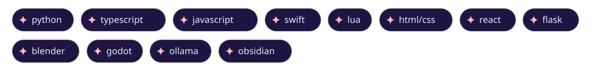

  

  

  
  

  

  

  <picture>
    <source media="(prefers-color-scheme: dark)" srcset="https://raw.githubusercontent.com/GA16-24/GA16-24/output/snake.svg"/>
    <source media="(prefers-color-scheme: light)" srcset="https://raw.githubusercontent.com/GA16-24/GA16-24/output/snake-light.svg"/>
    
  </picture>

  

